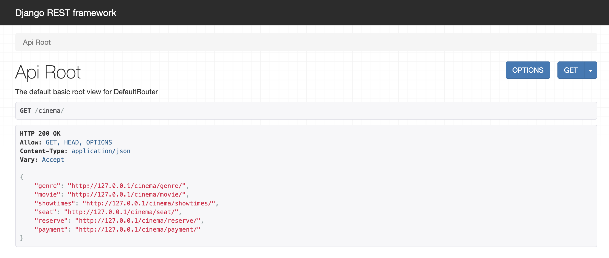
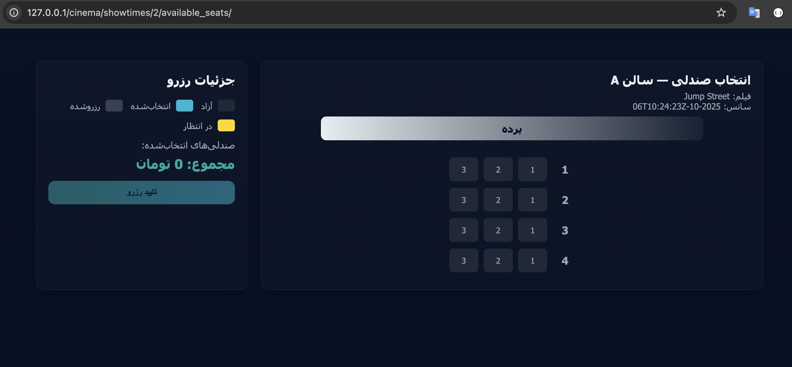

# Cinema Ticket
<hr>

CinemaTicket Project
<p align="center">
  
</p>
<p align="center">
  
</p>

# Run with Docker
<hr>
* First, you should install [Docker] <br>

* Then clone the project:
```
https://github.com/iamnimix/cinematicket.git
```


### After you created your ```.env``` file:

```commandline
DEBUG=False
SECRET_KEY=django-insecure-(baf(oh0)=@xwmt7pu@re3oe1!(yz2%k_tfc4))5qam*m6+b=_

# DATABASE
DB_NAME=cinematicket
DB_USER=iamnimix
DB_PASSWORD=iamnimix22
DB_HOST=db
DB_PORT=5432

#Celery
CELERY_BROKER_URL=redis://redis:6379
CELERY_RESULT_BACKEND=redis://redis:6379


#Redis
HOST=redis
```
### After :
```
docker compose up --build
```

### Then Migrate your database:
* First:
```
docker exec -it cinematicketproject-server-1 bash
```
* Then:
```
python manage.py makemigrations cinema, account
python manage.py migrate
```

### Finally :
```
python manage.py createsuperuser
```